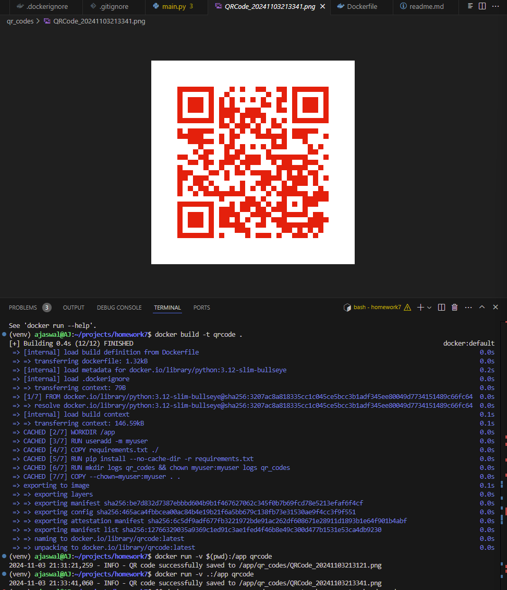

# Docker and Python
For this assignment you will be combining Docker with Python to create a program that generates a QR code PNG file that contains a URL. The QR code can be viewed with the camera on your phone to allow a user to click on it and send them to the target website. You must make your program generate a QR code that takes someone to your GitHub homepage

# Setup
Goto Docker.com and Install docker - https://www.docker.com/get-started/

Signup for your own Docker account

# Submission Requirements:

# QR code link to my GitHub Profile

# Logs image of QR creation

# Lesson Video
1.  Scaling and Backend Software Engineering
2.  Docker and Cloud Computing Intro
3.  Readings / Tutorials - No, really you should read these
4.  Containerization vs. Virtualization
5.  Official docker Getting Started - Go over all the sections
6.  Entrypoint vs. CMD vs. RUN
7.  Make QR with Python
8.  Make Dockerfile
9.  Args and Environment Variables in Docker